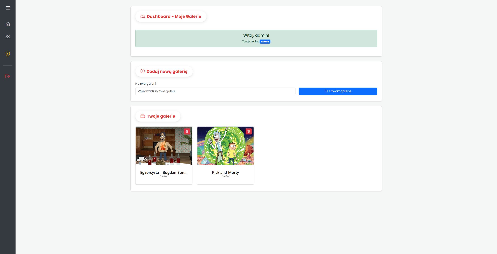

## Opis projektu
Projekt stanowi aplikację webową umożliwiającą tworzenie i zarządzanie galeriami zdjęć. Aplikacja została zaprojektowana w celu dostarczenia intuicyjnego interfejsu do publikacji, organizacji oraz współdzielenia obrazów między użytkownikami. Zastosowano tu system autoryzacji oparty o tokeny JWT, a wbudowany podział ról zapewnia odmienne ścieżki dostępu, oddzielając przywileje zwykłych użytkowników od uprawnień administratora. Całość interfejsu została poddana refaktoryzacji wizualnej, opierając się na nowoczesnych, animowanych elementach nawigacyjnych i zaokrąglonych krawędziach.

## ⚙️ Wdrożenie i uruchomienie aplikacji
Minimalne wymogi uruchomieniowe zakładają instalację środowiska uruchomieniowego Node.js oraz systemowego demona bazy MongoDB.

### Procedura startowa
1. Przed przystąpieniem do jakichkolwiek działań należy zainstalować wymagane zależności projektowe, wykonując komendę `npm install` w głównym katalogu aplikacji.
2. Konieczna jest weryfikacja poprawności działania demona bazy danych przed inicjalizacją środowiska backendowego (np. polecenie `Get-Service MongoDB` pod systemem operacyjnym Windows).
3. Inicjalizacja skryptu startowego realizowana jest za pomocą polecenia `npm start` z poziomu głównego katalogu.
4. Interfejs dostępowy zlokalizowany jest pod statycznym adresem `http://localhost:3000`.
5. System zabezpieczono wbudowanym w instancję kontem administracyjnym o prekonfigurowanych, domyślnych danych autoryzacyjnych.

### Inicjalizacja danymi demonstracyjnymi
Dla weryfikacji funkcjonalności zaimplementowano możliwość zasilenia systemu przykładowymi zbiorami (mock-data):
1. Proces importu realizowany jest w obrębie narzędzia analitycznego (np. MongoDB Compass), nakierowanego na przestrzeń `mongodb://localhost:27017/GalleryDB`.
2. Zbiory danych (kolekcje JSON) wczytywane są z repozytorium zewnętrznego (katalog `example_import`).
3. Warunkiem integralności systemu jest fizyczny transfer binarnych plików graficznych (`example_import/images`) do publicznego rejestru statycznego (`public/images`).
4. **Opcjonalnie (Alternatywa automatyczna):** Zamiast ręcznego importu struktur JSON za pomocą narzędzia Compass, proces zasilenia bazy można całkowicie zautomatyzować uruchamiając z poziomu terminala polecenie `node import_data.js` w głównym katalogu projektu. Skrypt ten samoistnie oczyści istniejące kolekcje i zadeklaruje dane demonstracyjne.

## ⚙️ Konstrukcja aplikacji
Architektura została oparta o standard wzorca projektowego Model-View-Controller (MVC) z użyciem technologii środowiska Node.js.
- **Logika biznesowa i routing:** Zrealizowane poprzez framework Express.js. Gwarantuje to obsługę zapytań asynchronicznych oraz ustandaryzowaną separację ścieżek dostępu (np. strefa autoryzowana w domenie `/dashboard`).
- **Warstwa danych:** Implementacja bazy nierelacyjnej MongoDB przy asyście biblioteki Mongoose. Logika przewiduje referencyjne powiązania pomiędzy dokumentami (User ↔ Gallery ↔ Image).
- **Warstwa prezentacji:** Generowana po stronie serwera przy pomocy silnika szablonów Pug. Stylizacja opiera się na szkielecie Bootstrap CSS, poszerzonym o reguły własne implementujące specyficzny design układu i responsywny panel boczny.
- **Bezpieczeństwo i Sesja:** Zarządzanie tożsamością zrealizowano bezstanowo przy użyciu algorytmów uwierzytelniających (JWT). Hasła przed utrwaleniem w bazie podlegają jednoznacznej operacji haszowania za pomocą algorytmu bcrypt.

## 📦 Wykorzystane pakiety Node.js
W architekturze projektu zintegrowano następujące pakiety wspierające, zarządzane przez system NPM:

| Pakiet | Wersja | Zastosowanie architektoniczne |
|--------|--------|-------------------------------|
| **bcrypt** | 6.0.0 | Zabezpieczanie poświadczeń poprzez asymetryczne haszowanie haseł. |
| **bootstrap** | 5.3.7 | Standaryzacja oraz responsywne stylowanie warstwy widoku front-endu. |
| **express** | 4.21.2 | Główny szkielet serwerowy do ewaluacji ścieżek dostępu (routingu) oraz asynchronicznej obsługi zapytań HTTP. |
| **jsonwebtoken** | 9.0.2 | Kryptograficzne podpisywanie i weryfikacja bezstanowych tokenów sesyjnych. |
| **mongoose** | 8.16.0 | Tworzenie struktury warstwy dostępu do danych (ODM) nakładającej sztywne modele i reguły walidacyjne na pliki MongoDB. |
| **multer** | 2.0.1 | Buforowanie oraz fizyczny zapis w pamięci masowej przesyłanych od klienta obrazów (strumieni `multipart/form-data`). |
| **pug** | 2.0.4 | Ekstrakcja danych obiektowych z serwera i konwersja ich do postaci strukturalnego, dynamicznego kodu HTML. |

## ⚠️ Ograniczenia
W strukturze systemu można zidentyfikować określone ograniczenia techniczne:
- **Zasoby dyskowe:** Obrazy przechowywane są w natywnym katalogu aplikacji (`public/images/`). Brak integracji z zewnętrznymi chmurami obliczeniowymi (np. AWS S3) potencjalnie utrudnia skalowalność horyzontalną rozwiązania przy rozroście systemu.
- **Optymalizacja zasobów:** Aplikacja obsługuje wczytywanie zdjęć synchronicznie bez wsparcia dla mechanizmu leniwego ładowania (lazy loading) lub paginacji, co w przypadku znaczącej liczby wpisów w galerii może determinować spadek wydajności renderowania widoków.
- **Obróbka graficzna:** Przesłane pliki są zapisywane w oryginalnej rozdzielczości i rozmiarze, bez zaimplementowanego mechanizmu bezstratnej kompresji przed zapisem przy użyciu dodatkowych modułów (np. Sharp).

## 📚 Modele danych
Zdefiniowano trzy zasadnicze modele obiektowo-dokumentowe odpowiadające kolekcjom bazy MongoDB:

| Model | Kolekcja | Pola strukturalne | Rola |
|-------|----------|-------------------|------|
| **User** | `users` | `username` (unikalny), `password` (hash), `role` | Encja reprezentująca użytkownika. Posiada rolę (`user` / `admin`), determinującą uprawnienia. |
| **Gallery** | `galleries` | `name`, `description`, `date`, `user` | Skupia zasoby wizualne oraz posiada relację zwrotną do właściciela (User). |
| **Image** | `images` | `name`, `description`, `path`, `gallery` | Zapis metadanych pojedynczego obrazu oraz jego bezwzględnej ścieżki w systemie plików. |

## 🔗 Prawa Dostępu
Proces modyfikacji danych został odizolowany przy użyciu ról:
- **Użytkownicy standardowi:** Uprawnieni do zakładania i usuwania własnych galerii, jak również wstawiania, modyfikacji oraz trwałego kasowania własnych obrazów. Mogą przeglądać otwarte galerie innych użytkowników.
- **Administratorzy:** Zyskują nieograniczony dostęp operacyjny (edycja lub usuwanie plików i galerii), egzekwowany zarówno poprzez wyizolowany panel administracyjny (`/admin`), jak i bezpośrednio wewnątrz standardowych widoków aplikacji, niezależnie od właściciela zasobu.

